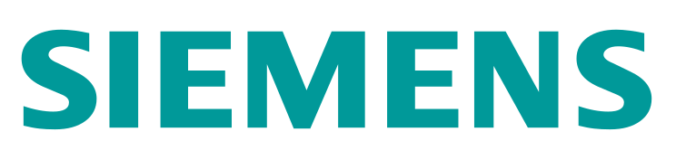
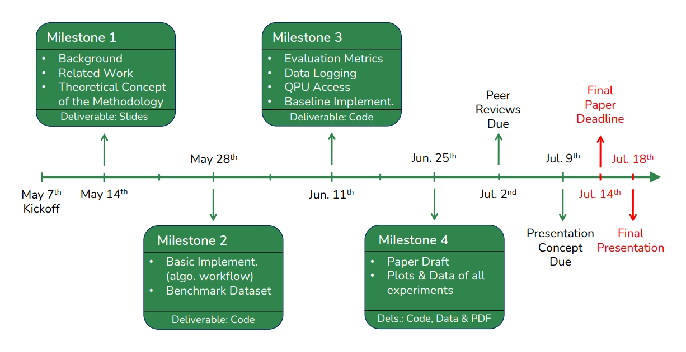

    
    
    

# Abgabe relevante Dateien: 
Der für die Abgabe relevante code befindet sich in folgenden Ordnern: 
    * Optimierter Ansatz mit verschiedenen Libraries: /main_pipeline/
    * Simpler Ansatz ohne libraries zur Optimierung: /pennylane/Ludwig/

## Milestones

    

